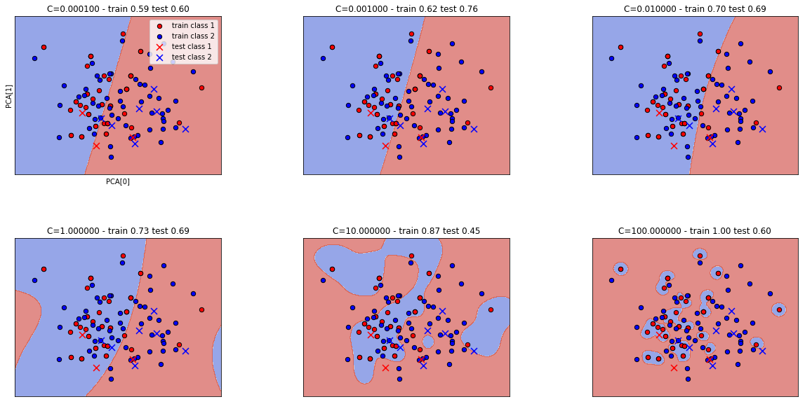

## Overfitting

Le terme "overfitting" correspond au cas où le prédicteur modélise trop étroitement les données d'apprentissage (jusqu'à
les apprendre "par coeur"), et de fait ne généralise pas ou très mal ses capacités sur de nouvelles données. 

* comment mesurer l'overfitting 
> (mesures oop, performances à 1, ect)
   * Evaluer l'erreur du modèle pour les données d'entrainement et les données de validation et de test.
    Si l'erreur est faible pour les données d'entrainement par rapport au données de test, dans ce cas on peut dire qu'il y a overfitting.

> (pourquoi la k-cross validation est pas suffisant, pourquoi un corpus de validation peut permettre de pallier à cela, ect.)

* comment éviter l'overfitting 

  * poser des contraintes sur les hyper-paramètres (lorsque cela est pertinent/possible). Pour certains classifieurs des paramètres 'extrêmes' (grands/petits) peuvent encourager l'overfitting
  
  * ajouter une régularisation (contrainte pour limiter la complexité du modèle)
  
  * augmenter les données en ajoutant des données bruitées
  
  * prendre en compte l'overfitting sur la sélection du modèle (et pas seulement sur l'apprentissage)
 (voir http://www.jmlr.org/papers/volume11/cawley10a/cawley10a.pdf), choisir une méthodologie non biaisée

## Variantes de cross-validation
* k-cross-validation
* k-fold cross-validation (un seul ensemble de données de test)
* k-fold cross-validation avec ensemble de test et de validation (plusieurs sous-ensembles comme données de test).

## Méthodes et techniques adaptées aux petits ensembles de données

* Choix d'un algorithme adapté

Non exhaustif: Random Forests, Naïve Bayes ...

* Augmenter les données. Différentes techniques de génération de nouvelles données à partir des données existantes.
Pour:

  * obtenir un dataset plus grand
  
  * et/ou réduire les déséquilibres entre classes

* Diminuer le bruit / le biais dans les données, retirer les outliers

  * auditer les échantillons existants
  
  * régulariser l'apprentissage
  
  * sur un faible volume de données les outliers peuvent avoir un impact important

## Application - Prédiction de l'activité cérébrale en fonction des signaux multimodaux
* k-fold cross-validation avec ensemble de test et de validation.
* Problème : la cross validation pose quelques problème pour les données séquentielles car elle tient pas en compte l'ordre chronologiques des données,
mais on peut l'appliquer dans notre cas si on considère chaque sous-ensemble est une conversation sous l'hypothèse que l'ordre des conversations n'est pas important.
* Dans ce cas, on peut découper les données en 4 ensembles, chaque ensemble contient 6 conversations. Sur chaque ensemble on peut appliquer une k-fold cross-validation avec une seule conversations comme données de test, et pour les autres, on change aléatoirement l'ordre des conversations à chaque fois on considère une conversation comme données de validation, et on répète ce processus, jusqu'à ce que chaque conversation des données d'entrainement est utilisée un fois comme données de validation.

## Application - Prédiction du sentiment de présence/co-présence en fonction des signaux multimodaux

Procédure:

* discrétisation des scores de présence/co-présence en problèmes de classification binaire

* 100x 90% train / 10% test splits aléatoires stratifiés (= conservant les proportions de chaque classe)

  * 10-fold cross-validation sur l'ensemble train pour la recherche d'hyper-paramètres du modèle

  * évaluation de la capacité de prédiction sur l'ensemble test (non vu lors de l'apprentissage)
  
  * moyennage des scores de test sur les 100 splits (avec calcul de l'erreur standard sur la moyenne)
  
## Application - Prédiction du sentiment de présence/co-présence en fonction des signaux multimodaux

Exemple d'overfitting: cas du SVM.

Le classifieur Support Vector Machine possède deux hyper-paramètres: C et gamma.
Le SVM classifie en séparant les données par un hyper-plan, avec la contrainte d'avoir une marge minimale
qui soit maximale (entre l'hyper-plan et les données). Le paramètre C influe sur le conflit entre maximiser
cette marge, et avoir des points mal classés (plus C est grand, plus les points mal classés sont exclus, et plus la
marge maximale a des chances d'être petite).

Un cas d'overfitting de ce classifieur peut se présenter si le paramètre C est 'trop' grand: le classifieur
tente alors de classer correctement chaque exemple d'apprentissage, au prix de la marge et ainsi d'une certaine
capacité de généralisation (la frontière de décision "épouse" les exemples d'apprentissage).

Ci-dessous on visualise cet effet sur la prédiction de présence, la dimension des données est réduite à deux par
PCA (Principal Component Analysis) afin de pouvoir visualiser le résultat et les frontières de décision:

(note: gamma est également modifié pour amplifier l'effet que l'on souhaite montrer)

## Techniques pour la génération de nouvelles données
> quelles sont les différentes techniques pour la génération de
  nouvelles données ?
  
* Random sampling

Pas a proprement parler de génération de nouvelles données, mais un re-sampling du dataset original
avec duplication d'échantillons (utilisé notamment pour résoudre les déséquilibres de classe en dupliquant
des échantillons de la classe minoritaire)

* SMOTE, ADASYN

Techniques synthétisant de nouveaux échantillons à partir d'échantillons existant par interpolation.
(pour les variables catégorielles, la catégorie retenue est la catégorie majoritaire parmis les plus proches voisins)

* GAN

Les réseaux antagonistes génératifs peuvent être utilisés pour générer de nouvelles données, après leur avoir
appris la distribution des données existantes.
Un réseau génératif génère des données, le réseau adversaire discrimine entre une vraie donnée et une donnée générée.
L'apprentissage demande généralement beaucoup de données et l'atteinte d'un point d'équilibre entre les deux réseaux.

## Génération de données - application sur la prédiction de présence
 
 > leurs limites ? peut-on les appliquées sur des
  données comportementales comme les nôtres ?
 
 Les techniques basées sur le deep learning (GAN) demandent généralement de grands volumes de données.
 D'autre part, la validation de la génération des données est qualitative, ce qui est aisé lorsque les données
 sont des images, mais ici il est compliqué de vérifier la qualité des échantillons générés.
 
 Les autres techniques (random sampling, smote, adasyn, et leurs variantes) visent à corriger un déséquilibre entre classes
 en synthétisant des échantillons supplémentaires pour la classe minoritaire, l'argument étant que la plupart des algorithmes
 de machine learning sont moins performants lorsqu'il y a un tel déséquilibre.
 En pratique ici avec des déséquilibres moyennement importants (en pourcentage), l'efficacité de ses techniques
 n'est pas démontrée, du moment que le déséquilibre entre classes est correctement pris en compte pour le calcul
 des scores.
 D'autre part ces techniques se basent sur des échantillons existants, sans pouvoir discriminer si les échantillons choisis
 sont les plus représentatifs de la loi recherchée, ou si au contraire ils s'en éloignent le plus. SVM SMOTE utilise un classifieur
 SVM pour tenter d'améliorer ce point (là encore, avec des résultats peu significatifs dans notre cas).
 

